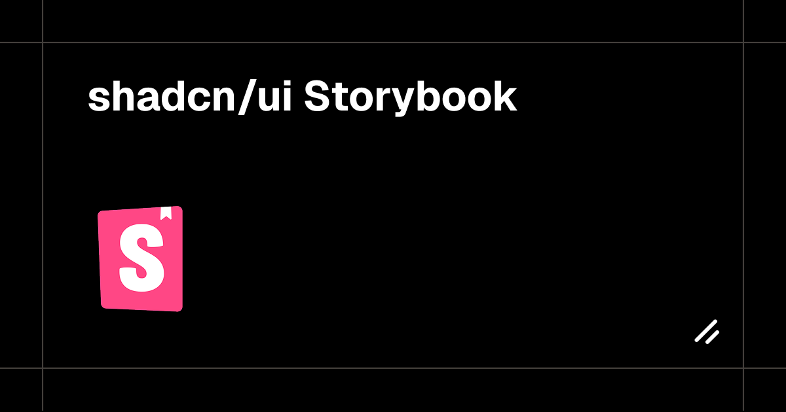

# shadcn/ui Storybook

[shadcn/ui](https://ui.shadcn.com/) is a set of beautifully-designed, accessible components and a code distribution platform. This Storybook provides a [component-driven](https://www.componentdriven.org/) development environment for shadcn/ui components.

This Storybook environment adds extra benefits:

- Interactive component previews
- Props documentation and controls
- Component state management
- Visual testing
- Component isolation

## Credits

- [shadcn/ui](https://ui.shadcn.com/) - @shadcn and the shadcn-ui team
- [Radix UI](https://radix-ui.com) - For the primitives
- [Storybook](https://storybook.js.org/) - @storybookjs
- Maintained by [@hamedmp](https://github.com/hamedmp)

## Installation script for all shadcn components:

```bash
pnpm dlx shadcn@latest add accordion alert alert-dialog aspect-ratio avatar \
            badge breadcrumb button \
            calendar card carousel chart checkbox collapsible command context-menu \
            dialog drawer dropdown-menu \
            form \
            hover-card \
            input \
            input-otp \
            label \
            menubar \
            navigation-menu \
            pagination popover progress \
            radio-group resizable \
            scroll-area select separator sheet sidebar skeleton slider sonner switch \
            table tabs textarea toggle toggle-group tooltip
```

## License

MIT © [shadcn](https://shadcn.com)
